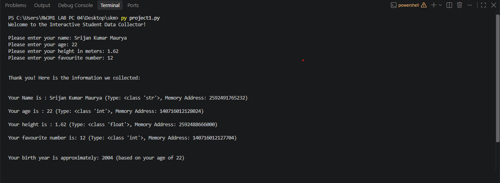

# 🎓 Interactive Student Data Collector

An educational command-line utility built in Python. The script serves as a practical demonstration of user input handling, explicit data type casting, basic arithmetic operations, and Python's internal memory management tracking.

---

## 📌 Project Description

The Interactive Student Data Collector is a lightweight console application that captures basic information from a student. 

The program prompts the user to input their name, age, height, and favourite number. It then displays the collected information alongside its runtime evaluation metadata: its explicit Python class data type and its unique system object identity pointer. Additionally, it calculates and displays the user's approximate birth year based on their current age.

---

## ✨ Features

- **Interactive Prompts**: Gathers standard inputs for student name, age, height, and numeric preferences.
- **Dynamic Birth Year Calculation**: Automatically estimates the user's birth year using a reference calendar anchor.
- **Type Inspection**: Demonstrates Python's core dynamic type assignment by rendering the underlying variable class signatures.
- **Memory Address Analysis**: Leverages system reflection utilities to output individual object identity numbers.
- **Clean Interface**: Utilizes Python formatted string literals (f-strings) for clean variable interpolation and console formatting.

---

## 🛠️ Technologies & Functions Used

- **Runtime Environment**: Python 3 (No external third-party package dependencies required)
- **Built-in Functions**:
  - `input()`: Captures alphanumeric byte-streams from standard system input.
  - `print()`: Pipes formatted text blocks out to the standard system output stream.
  - `int()`: Type-casts inputs into whole-number integer values.
  - `float()`: Type-casts inputs into precise double-precision floating-point numbers.
  - `type()`: Reflectively inspects and returns an object's dynamic class descriptor.
  - `id()`: Extracts the unique integer address allocated to an object during its lifecycle.

---

## 📚 Python Concepts Demonstrated

This project is meticulously designed to serve as a baseline sandbox for practicing foundational programming principles:

### 1. Variables
The script instantiates and references distinct namespace containers to store live data arrays:
- `name`
- `age`
- `height`
- `favourite_number`

### 2. Primitive Data Types
The program works directly with three foundational Python data structures:

| Variable Name | Extracted Class Type | Description |
| :--- | :--- | :--- |
| `name` | String (`str`) | Alphanumeric text data sequences |
| `age` | Integer (`int`) | Discretized whole numbers |
| `height` | Float (`float`) | Precision decimal values representing metrics |
| `favourite_number` | Integer (`int`) | Discretized whole numbers |

### 3. Explicit Type Conversion (Casting)
By default, Python reads all standard terminal input as raw strings. The program demonstrates explicit casting techniques to convert these arrays into math-ready numerical objects before runtime evaluation:
```python
age = int(input("Please enter your age: "))
height = float(input("Please enter your height in meters: "))
```

### 4. Dynamic Reflection (`type()` & `id()`)
- **`type(variable)`**: Evaluates runtime object layouts and prints explicit type mappings (e.g., `<class 'int'>`).
- **`id(variable)`**: Returns an integer that maps directly to the actual memory address where that specific object resides within the system RAM (in standard CPython implementations). 

> 💡 *Note: The memory addresses returned by `id()` are highly dynamic and will differ on every application runtime or hardware cycle.*

---

## 📅 Birth Year Calculation Architecture

The application uses a predictable subtraction logic routine to compute historical dates:

```python
current_year = 2026
birth_year = current_year - age
```

### Operational Example:
If a user inputs a terminal value of `20` for their age:
\[\text{2026} - \text{20} = \text{2006}\]

The terminal safely handles this evaluation and strings together the following feedback:
```text
Your birth year is approximately: 2006 (based on your age of 20)
```

> ⚠️ *Note: This timeline calculation remains a close approximation because the routine does not process months or specific birthdates.*

---

## 📁 Project Structure

```
├── main.py     
├── output.png                   
└── README.md                     
```
## Output


---

## ▶️ How To Run

### 1. Verify Local Runtime Installation
Ensure that you have Python 3 correctly configured inside your workspace environment. Open a command shell and type:
```bash
python --version
```

### 2. File Location Setup
Confirm that your directory contains the core script named exactly `student_data_collector.py`.

### 3. Execution Pipeline
Open your terminal inside the root project directory and execute the following instruction:
```bash
python student_data_collector.py
```

---

## 💻 Example Output Simulation

Below is a contextual preview trace showing how the script prints inputs, type mappings, and memory profiles out to the shell:

```text
Welcome to the Interactive Student Data Collector!

Please enter your name: Rahul
Please enter your age: 20
Please enter your height in meters: 1.75
Please enter your favourite number: 7


Thank you! Here is the information we collected:


Your Name is : Rahul (Type: <class 'str'>, Memory Address: 140223591244144)

Your age is : 20 (Type: <class 'int'>, Memory Address: 94653210452320)

Your height is : 1.75 (Type: <class 'float'>, Memory Address: 140223590888240)

Your favourite number is: 7 (Type: <class 'int'>, Memory Address: 94653210451904)


Your birth year is approximately: 2006 (based on your age of 20)


Thank you for using the Student Data Collector. Goodbye!
```

---

## ⚠️ Limitations

As a baseline learning script, this application runs on an unvalidated happy-path configuration:
* **Unprotected Inputs**: Typing characters or special symbols into numeric questions like `age` or `height` causes an unhandled `ValueError` crash.
* **Hardcoded Calendar Anchors**: The computation relies on a hardcoded calendar literal (`2026`). The calculation will shift if run in subsequent years.
* **Volatile Scope**: The application holds no long-term persistence layer; collected data variables are immediately cleared from memory upon program termination.

---

## 🚀 Future Improvements

To transition this script into a production utility, consider adding the following code features:
1. **Input Validation Loops**: Enclose string conversions inside `try/except` modules to catch formatting anomalies safely.
2. **Dynamic Datetime Integration**: Import the native Python `datetime` package to retrieve the actual calendar year dynamically.
3. **Data File Persistence**: Append incoming telemetry outputs into a local structural `.json` array or a `.csv` data table.
4. **Graphical Client Build**: Wrap the processing logic into a sleek visual interface using tools like `tkinter` or `PyQt`.

---

## 🎯 Purpose

This project is created for educational and foundational learning purposes. It provides a simple sandbox environment to help programmers master:
- Dynamic console interactions (`input` & `print`)
- Memory address tracing via object tracking
- Primitive mutations and basic arithmetic calculations
- Formatted clean string outputs

---

## 👨‍💻 Author
** SRIJAN KUMAR MAURYA**
**InteraCollectorctive Student Data ** - Developed as a beginner-friendly code pattern for practicing essential software design fundamentals.

